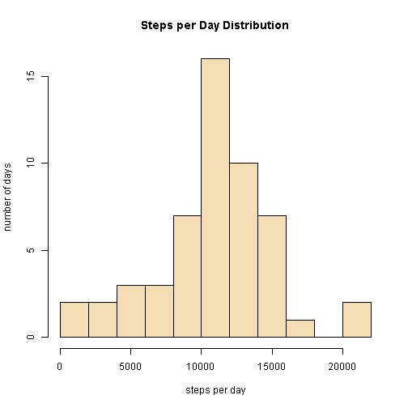
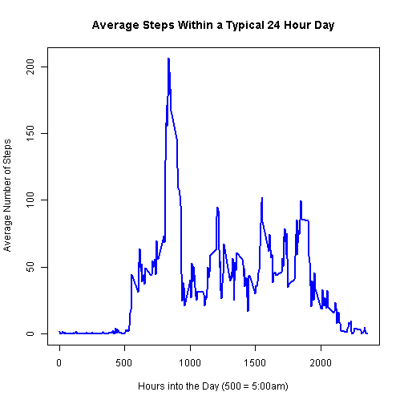
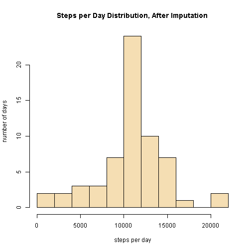

# Reproducible Research: Peer Assessment 1


## Loading and preprocessing the data


```r
act <- read.csv("activity.csv", strip.white = T, stringsAsFactors = F)
str(act)
```

```
## 'data.frame':	17568 obs. of  3 variables:
##  $ steps   : int  NA NA NA NA NA NA NA NA NA NA ...
##  $ date    : chr  "2012-10-01" "2012-10-01" "2012-10-01" "2012-10-01" ...
##  $ interval: int  0 5 10 15 20 25 30 35 40 45 ...
```

```r

act$date <- as.Date(act$date, format = "%Y-%m-%d")

summary(act)
```

```
##      steps            date               interval   
##  Min.   :  0.0   Min.   :2012-10-01   Min.   :   0  
##  1st Qu.:  0.0   1st Qu.:2012-10-16   1st Qu.: 589  
##  Median :  0.0   Median :2012-10-31   Median :1178  
##  Mean   : 37.4   Mean   :2012-10-31   Mean   :1178  
##  3rd Qu.: 12.0   3rd Qu.:2012-11-15   3rd Qu.:1766  
##  Max.   :806.0   Max.   :2012-11-30   Max.   :2355  
##  NA's   :2304
```


## What is mean total number of steps taken per day?

For this part of the assignment, ignore the missing values in the dataset.  
1. Make a histogram of the total number of steps taken each day.  
1. Calculate and report the mean and median total number of steps taken per day.  

```r

# sum steps at the daily level
steps.daily <- aggregate(steps ~ date, data = act, sum)

# check that the total steps in the per-day data equals the total steps in
# the original data
if (sum(steps.daily$steps) == sum(act$steps, na.rm = T)) {
    message("Sum of steps is OK")
} else message("Error: Sum of steps has changed")
```

```
## Sum of steps is OK
```

```r

head(steps.daily, n = 10)
```

```
##          date steps
## 1  2012-10-02   126
## 2  2012-10-03 11352
## 3  2012-10-04 12116
## 4  2012-10-05 13294
## 5  2012-10-06 15420
## 6  2012-10-07 11015
## 7  2012-10-09 12811
## 8  2012-10-10  9900
## 9  2012-10-11 10304
## 10 2012-10-12 17382
```

```r

with(steps.daily, hist(steps, main = "Steps per Day Distribution", xlab = "steps per day", 
    ylab = "number of days", breaks = 11, col = "wheat"))
```

 

```r

mean.steps.per.day <- mean(steps.daily$steps)
median.steps.per.day <- median(steps.daily$steps)

cat("Mean number of steps per day = ", mean.steps.per.day)
```

```
## Mean number of steps per day =  10766
```

```r
cat("Median number of steps per day = ", median.steps.per.day)
```

```
## Median number of steps per day =  10765
```


## What is the average daily activity pattern?

1. Make a time series plot (i.e. type = "l") of the 5-minute interval (x-axis) and the average number of steps taken, averaged across all days (y-axis)
1. Which 5-minute interval, on average across all the days in the dataset, contains the maximum number of steps?

- This time, you will have to compute the average steps in each 5-minute interval (interval column in the data frame)
- Each date will have 288 5-minute intervals.  You will need to compute the average number of steps (across all days) for each of these intervals.
- The resulting data frame will have 288 rows with each row representing one 5-minute interval.
- Plot the data with the interval on the x-axis and the average steps of each interval on the y-axis.
- See the reference plot on the PA1 instructions.

```r

steps.5min <- aggregate(steps ~ interval, data = act, FUN = mean)

with(steps.5min, plot(interval, steps, type = "l", main = "Average Steps Within a Typical 24 Hour Day", 
    xlab = "Hours into the Day (500 = 5:00am)", ylab = "Average Number of Steps"))
```

 


## Imputing missing values

Note that there are a number of days/intervals where there are missing values (coded as NA). The presence of missing days may introduce bias into some calculations or summaries of the data.

Calculate and report the total number of missing values in the dataset (i.e. the total number of rows with NAs)

```r
na.rows <- nrow(act) - sum(complete.cases(act))
cat("The data have", na.rows, "rows with missing values (NA)")
```

```
## The data have 2304 rows with missing values (NA)
```


Devise a strategy for filling in all of the missing values in the dataset. The strategy does not need to be sophisticated. For example, you could use the mean/median for that day, or the mean for that 5-minute interval, etc.

- use the interval's mean number of steps (averaged over all days)
- this has already been computed in steps.5min

Create a new dataset that is equal to the original dataset but with the missing data filled in.

```r

# keep only non-missing rows
nonmissrows <- act[complete.cases(act), ]

# separate out missing rows, keeping only the date and interval columns
missingrows <- act[!(complete.cases(act)), -1]

# impute missing steps
imputedrows <- merge(missingrows, steps.5min, by = "interval", all.x = TRUE)

# put the imputed rows back with the non-missing rows
act.imputed <- rbind.data.frame(nonmissrows, imputedrows)
act.imputed <- act.imputed[order(act.imputed$date, act.imputed$interval), ]
```


Make a histogram of the total number of steps taken each day and Calculate and report the mean and median total number of steps taken per day. Do these values differ from the estimates from the first part of the assignment? What is the impact of imputing missing data on the estimates of the total daily number of steps?

```r

# sum steps at the daily level
steps.daily <- aggregate(steps ~ date, data = act.imputed, sum)

# check that the total steps in the per-day data equals the total steps in
# the original data
if (sum(steps.daily$steps) == sum(act.imputed$steps, na.rm = T)) {
    message("Sum of steps is OK")
} else message("Error: Sum of steps has changed")
```

```
## Sum of steps is OK
```

```r

head(steps.daily, n = 10)
```

```
##          date steps
## 1  2012-10-01 10766
## 2  2012-10-02   126
## 3  2012-10-03 11352
## 4  2012-10-04 12116
## 5  2012-10-05 13294
## 6  2012-10-06 15420
## 7  2012-10-07 11015
## 8  2012-10-08 10766
## 9  2012-10-09 12811
## 10 2012-10-10  9900
```

```r

with(steps.daily, hist(steps, main = "Steps per Day Distribution", xlab = "steps per day", 
    ylab = "number of days", breaks = 11, col = "wheat"))
```

 

```r

mean.steps.per.day <- mean(steps.daily$steps)
median.steps.per.day <- median(steps.daily$steps)

cat("Mean number of steps per day after imputation = ", mean.steps.per.day)
```

```
## Mean number of steps per day after imputation =  10766
```

```r
cat("Median number of steps per day after imputation = ", median.steps.per.day)
```

```
## Median number of steps per day after imputation =  10766
```


## Are there differences in activity patterns between weekdays and weekends?
